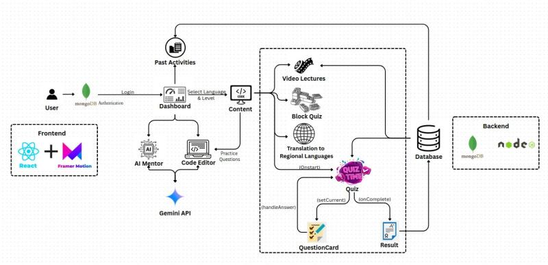

# TinkerFlow — Visual AI Programming Tutor

TinkerFlow is a **Visual AI Programming Tutor** designed for rural and village learners. 
It provides an **offline-first**, gamified, and localized learning experience for programming fundamentals using AI assistance.

---

## Features

- **Visual Programming**: Block-based & flow-based coding interface for beginners.  
- **Offline-First**: Works without continuous internet access.  
- **Gamified Learning**: Levels, badges, and interactive challenges.  
- **Local Language Support**: Multi-language content for accessibility.  
- **AI Tutor**: Integrated LLM assistant for guidance and doubt solving.  
- **Progress Tracker**: Tracks learning streaks and skill progression.  

---

## Tech Stack

- **Frontend**: React / Svelte  
- **Backend**: Python (FastAPI / Flask)  
- **Database**: SQLite (offline), Firestore (cloud sync)  
- **AI Models**: Ollama / Local LLM + Gemini for assistance  
- **Other Tools**: Docker, GitHub Actions, Figma for design  

---

## Pipeline



---

## Project Structure

```
TinkerFlow/
│── frontend/         # UI for visual programming
│── backend/          # APIs and AI tutor logic
│── models/           # AI/LLM models
│── data/             # Sample exercises, local DB
│── docs/             # Documentation
│── README.md         # This file
```

---

## Setup & Installation

```bash
# Clone the repo
git clone https://github.com/<your-org>/TinkerFlow.git
cd TinkerFlow

# Setup backend
cd backend
pip install -r requirements.txt
uvicorn main:app --reload

# Setup frontend
cd frontend
npm install
npm run dev
```

---

## Future Roadmap

- Offline sync with P2P support  
- More regional language translations  
- Integration with rural school systems  
- AI-driven personalized lesson plans  

---
